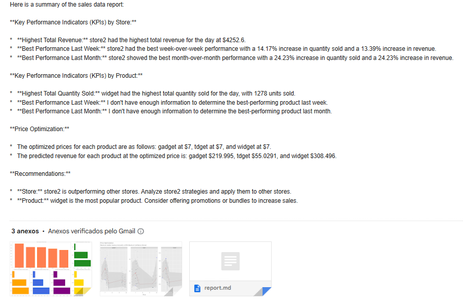
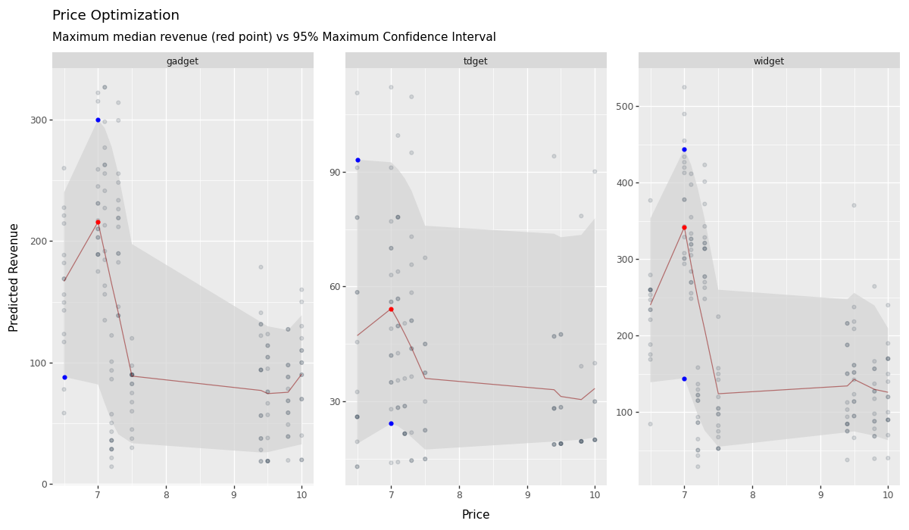

# Data Pipeline with API Integration and AI Analysis


## Overview

This project demonstrates an ETL (Extract, Transform, Load) pipeline for a hypothetical company with chain of 5 stores, processing 1000 transactions a day. <br>
Being a small business, it should not have to go to expensive solutions like Databricks to process large quantities of data. So, we present DuckDB as a good solution.

**Here is the flow of the data in this pipeline:**

1. **FastAPI**: API integration, with data extracted daily (or customizable for the needed cadence)
2. **DuckDB** to quickly process, transform and load the clean data to a DB. The choice of DuckDB technology was due to its ability to process large sets of data locally and fastly.
3. Price Optimization with Generalized Additive Model (**PyGAM**). The clean data is promptly analyzed to find the optimized price for each of the products.
4. A Report is generated with the KPIs.
5. AI Agent: An AI Agent by **Agno** analyzes the content of the KPIs for the day and generates a report.
6. This report is automatically sent via email for a manager.

## Features

* Extracts data from a source (simulated in this case).
* Transforms the data using Python and DuckDB.
* Loads the transformed data into a DuckDB database.
* Calculate KPIs.
* Estimate optimal price with PyGAM.
* Analyzes data with AI Agent.
* Sends email automatically.


## Requirements

* Python 3.8+
* `duckdb` >= 1.2.2
* `fastapi` >= 0.115.12
* `pandas` >= 2.2.3
* `uvicorn` >= 0.34.2
* `numpy` >= 2.2.5
* `requests` >= 2.32.3
* `pyarrow` >= 20.0.0
* `fastparquet` >= 2024.11.0
* `agno` > =1.5.2
* `google-genai` >= 1.16.1
* `matplotlib` >= 3.10.3
* `tabulate` >= 0.9.0
* `pygam` >= 0.8.0
* `plotnine` >= 0.14.5

## Code Structure

* `extract.py`: This script is responsible for extracting data from a source. It likely simulates data extraction in this example.
* `transform.py`: This script transforms the extracted data. It may involve cleaning, filtering, and aggregating the data using DuckDB.
* `load.py`: This script loads the transformed data into a DuckDB database.
* `price_optimization`: Script to estimate the optimal price per product using a Generalize Additive Model.
* `report.py`: This script analyzes data and creates the report in markdown format. To be used as a tool by the AI Agent.
* `utils.py`: Script to automate email with the report.
* `main.py`: This is the main script to orchestrate the whole etl process, AI Agent Analysis and e-mail automation.

## How to Run This Project

### API Keys needed: Before running the project, you will need to get API key for:

* [Google Gemini](https://ai.google.dev/gemini-api/docs/api-key)
* [GMail Access Key](https://support.google.com/mail/thread/205453566/how-to-generate-an-app-password?hl=en)
  - Access your Google Account (*in Gmail, click on your avatar on the top righ-hand side)
  - Once logged in, there is a search bar on the center of the page. Search for "*App Access Key*"
  - Go to the result. Write the description of the app.
  - Click Create.

1. Clone the repository.
  
```bash
git clone https://github.com/gurezende/ETL_DuckDB
```

2. Create a virtual environment

```python
python -m venv .venv
```
  
3. Activate the virtual environment
  
```bash
source .venv/bin/activate (Linux/macOS) or .venv\Scripts\activate (Windows)
```

4. Install the dependencies
  
 ```python
pip install -r requirements.txt
 ```

5. Create a `.env` file in your project folder and save the API Keys and Email configs.
```
GEMINI_API_KEY="your-api-key"
EMAIL_PASSWORD="your-Gmail-Access-App-key"
SENDER_EMAIL="youremail@email.com"
RECIPIENT_EMAIL="theiremail@gmail.com"
```

6. Run the API that generates the data

```bash
uvicorn scripts.api:app --reload
```

7. Run the main script

```bash
python main.py
```

## KPIs Generated

**By Store:**<br>

* The total quantity sold of each product <br>

* The total revenue generated from each product by store <br>
* The total revenue generated by store <br>

**By Product:**<br>

* The total quantity sold of each product<br>
* The average price of each product<br>
* The average quantity sold of each product<br>
* The total revenue generated from each product<br>

## License

Project using MIT License

## Demonstration

<table>
  <tr>
    <td width="33%"></td>
    <td width="33%"></td>
    <td width="33%"></td>
  </tr>
</table>

## Known Issues

1. There were some issues adding the project to Docker due to incompatibilities among the packages. Docker is not being able to install Scipy. <br>
2. PyGAM's last commit was on *Feb, 2024*. Since then, there is a compatibility issue for newer versions of `numpy`/ `scipy`. Here is the fix:

* Manually change line 739 of **.venv/Lib/site-packages/pygam/pygam.py** to `Q, R = np.linalg.qr(WB.toarray())`.
* Manually change line 82 of **.venv/Lib/site-packages/pygam/utils.py** to `A = A.toarray()`. 
* There may be more places as well, depending on which models you use. The broad fix is just to replace `.A` with `.toarray()` everywhere you get that error.
* For more solutions to this error, refer to the issue [#357](https://github.com/dswah/pyGAM/issues/357) in PyGAM's repo.

## About Me

This project was created by Gustavo R Santos (https://gustavorsantos.me)