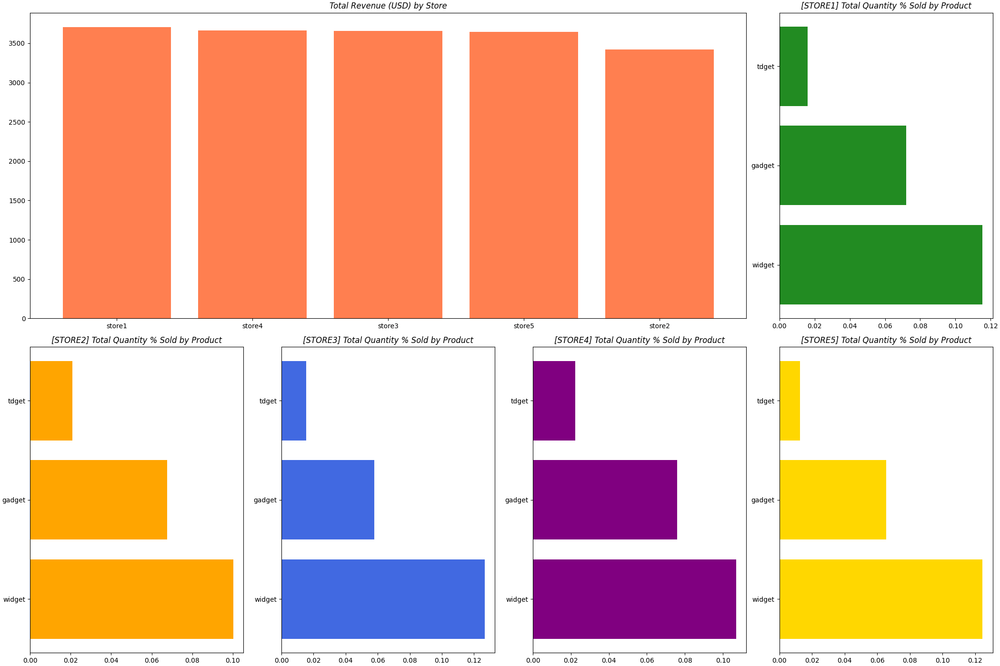

# KPIs REPORT
Attached is the report for the day: **2025-05-22**.

## **|> KPIs by STORE**

### Total Quantity Sold & Revenue By Store
|    | store   |   total_qty |   total_revenue |   pct_qty |   pct_revenue |
|---:|:--------|------------:|----------------:|----------:|--------------:|
|  2 | store3  |         507 |          3819.4 |  0.213654 |      0.212335 |
|  3 | store4  |         497 |          3749   |  0.20944  |      0.208421 |
|  1 | store2  |         481 |          3675.3 |  0.202697 |      0.204324 |
|  4 | store5  |         459 |          3467.8 |  0.193426 |      0.192788 |
|  0 | store1  |         429 |          3276.1 |  0.180784 |      0.182131 |

### Total Quantity By Product By Store
|    | store   | product   |   total_qty |       pct |
|---:|:--------|:----------|------------:|----------:|
|  2 | store1  | widget    |         230 | 0.0969237 |
|  0 | store1  | gadget    |         156 | 0.0657396 |
|  1 | store1  | tdget     |          43 | 0.0181205 |
|  5 | store2  | widget    |         252 | 0.106195  |
|  3 | store2  | gadget    |         155 | 0.0653182 |
|  4 | store2  | tdget     |          74 | 0.0311842 |
|  8 | store3  | widget    |         273 | 0.115044  |
|  6 | store3  | gadget    |         179 | 0.0754319 |
|  7 | store3  | tdget     |          55 | 0.0231774 |
| 11 | store4  | widget    |         294 | 0.123894  |
|  9 | store4  | gadget    |         169 | 0.0712179 |
| 10 | store4  | tdget     |          34 | 0.0143279 |
| 14 | store5  | widget    |         229 | 0.0965023 |
| 12 | store5  | gadget    |         187 | 0.0788032 |
| 13 | store5  | tdget     |          43 | 0.0181205 |

## **|> KPIs by PRODUCT**

### Total Quantity Sold & Revenue By Product
|    | product   |   total_qty |   total_revenue |   pct_qty |   pct_revenue |
|---:|:----------|------------:|----------------:|----------:|--------------:|
|  2 | widget    |        1278 |          9734.5 |  0.538559 |      0.541178 |
|  0 | gadget    |         846 |          6396.2 |  0.356511 |      0.355589 |
|  1 | tdget     |         249 |          1856.9 |  0.10493  |      0.103232 |

### Week-Over-Week (WoW) Total Quantity Sold & Revenue By Store
|    | store   |   total_qty |   total_revenue |   last_week_qty |   last_week_revenue |    WoW_qty |   WoW_revenue |
|---:|:--------|------------:|----------------:|----------------:|--------------------:|-----------:|--------------:|
|  3 | store4  |         497 |          3749   |             439 |              3336   |  0.132118  |     0.123801  |
|  2 | store3  |         507 |          3819.4 |             485 |              3656   |  0.0453608 |     0.0446937 |
|  4 | store5  |         459 |          3467.8 |             450 |              3425   |  0.02      |     0.0124964 |
|  1 | store2  |         481 |          3675.3 |             502 |              3786.1 | -0.0418327 |    -0.0292649 |
|  0 | store1  |         429 |          3276.1 |             445 |              3375.2 | -0.0359551 |    -0.0293612 |

### Month-Over-Month (MoM) Total Quantity Sold & Revenue By Store
|    | store   |   total_qty |   total_revenue |   last_month_qty |   last_month_revenue |     MoM_qty |   MoM_revenue |
|---:|:--------|------------:|----------------:|-----------------:|---------------------:|------------:|--------------:|
|  2 | store3  |         507 |          3819.4 |              422 |               3221.8 |  0.201422   |     0.185486  |
|  3 | store4  |         497 |          3749   |              476 |               3559.1 |  0.0441176  |     0.0533562 |
|  1 | store2  |         481 |          3675.3 |              482 |               3620.4 | -0.00207469 |     0.0151641 |
|  4 | store5  |         459 |          3467.8 |              459 |               3503.1 |  0          |    -0.0100768 |
|  0 | store1  |         429 |          3276.1 |              545 |               4102.6 | -0.212844   |    -0.201458  |

## Price Optimization
These are the optimized prices for each product by store:
|    |   price | product   |   quantity |   pred_0.025 |   pred_0.5 |   pred_0.975 |   revenue_pred_0.025 |   revenue_pred_0.5 |   revenue_pred_0.975 |   revenue_actual |
|---:|--------:|:----------|-----------:|-------------:|-----------:|-------------:|---------------------:|-------------------:|---------------------:|-----------------:|
|  0 |       7 | gadget    |         27 |     14.7692  |    33.2898 |      46.6211 |              103.384 |           233.029  |              326.348 |              189 |
|  1 |       7 | tdget     |         13 |      4.03329 |    10.0498 |      15.708  |               28.233 |            70.3487 |              109.956 |               91 |
|  2 |       7 | widget    |         46 |     20.9308  |    43.421  |      56.9953 |              146.516 |           303.947  |              398.967 |              322 |

## Dashboard

