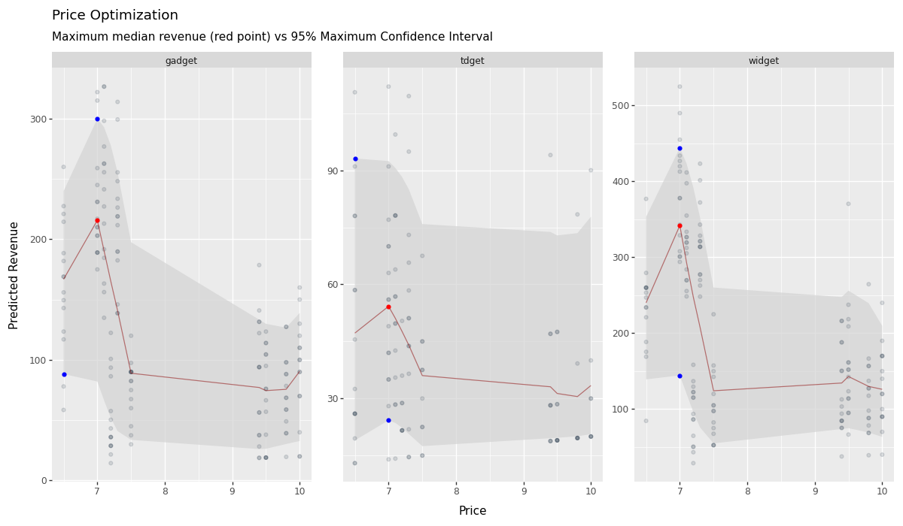

# KPIs REPORT
Attached is the report for the day: **2025-05-23**.

## **|> KPIs by STORE**

### Total Quantity Sold & Revenue By Store
|    | store   |   total_qty |   total_revenue |   pct_qty |   pct_revenue |
|---:|:--------|------------:|----------------:|----------:|--------------:|
|  0 | store1  |         980 |          7479.5 |  0.205839 |      0.206328 |
|  2 | store3  |         974 |          7471   |  0.204579 |      0.206093 |
|  1 | store2  |         933 |          7169.3 |  0.195967 |      0.197771 |
|  3 | store4  |         954 |          7124.8 |  0.200378 |      0.196543 |
|  4 | store5  |         920 |          7006   |  0.193237 |      0.193266 |

### Total Quantity By Product By Store
|    | store   | product   |   total_qty |       pct |
|---:|:--------|:----------|------------:|----------:|
|  2 | store1  | widget    |         509 | 0.10691   |
|  0 | store1  | gadget    |         376 | 0.078975  |
|  1 | store1  | tdget     |          95 | 0.0199538 |
|  5 | store2  | widget    |         488 | 0.102499  |
|  3 | store2  | gadget    |         352 | 0.073934  |
|  4 | store2  | tdget     |          93 | 0.0195337 |
|  8 | store3  | widget    |         557 | 0.116992  |
|  6 | store3  | gadget    |         346 | 0.0726738 |
|  7 | store3  | tdget     |          71 | 0.0149128 |
| 11 | store4  | widget    |         506 | 0.10628   |
|  9 | store4  | gadget    |         348 | 0.0730939 |
| 10 | store4  | tdget     |         100 | 0.021004  |
| 14 | store5  | widget    |         534 | 0.112161  |
| 12 | store5  | gadget    |         314 | 0.0659525 |
| 13 | store5  | tdget     |          72 | 0.0151229 |

## **|> KPIs by PRODUCT**

### Total Quantity Sold & Revenue By Product
|    | product   |   total_qty |   total_revenue |   pct_qty |   pct_revenue |
|---:|:----------|------------:|----------------:|----------:|--------------:|
|  2 | widget    |        2594 |         19727.6 | 0.544844  |      0.544201 |
|  0 | gadget    |        1736 |         13246.2 | 0.364629  |      0.365406 |
|  1 | tdget     |         431 |          3276.8 | 0.0905272 |      0.090393 |

### Week-Over-Week (WoW) Total Quantity Sold & Revenue By Store
|    | store   |   total_qty |   total_revenue |   last_week_qty |   last_week_revenue |     WoW_qty |   WoW_revenue |
|---:|:--------|------------:|----------------:|----------------:|--------------------:|------------:|--------------:|
|  1 | store2  |         933 |          7169.3 |             869 |              6714.9 |  0.0736479  |    0.0676704  |
|  3 | store4  |         954 |          7124.8 |             919 |              6948   |  0.0380849  |    0.0254462  |
|  2 | store3  |         974 |          7471   |             982 |              7451.4 | -0.00814664 |    0.00263038 |
|  4 | store5  |         920 |          7006   |             939 |              7107.5 | -0.0202343  |   -0.0142807  |
|  0 | store1  |         980 |          7479.5 |            1007 |              7662.4 | -0.0268123  |   -0.0238698  |

### Month-Over-Month (MoM) Total Quantity Sold & Revenue By Store
|    | store   |   total_qty |   total_revenue |   last_month_qty |   last_month_revenue |    MoM_qty |   MoM_revenue |
|---:|:--------|------------:|----------------:|-----------------:|---------------------:|-----------:|--------------:|
|  1 | store2  |         933 |          7169.3 |              884 |               6676.8 |  0.0554299 |     0.0737629 |
|  4 | store5  |         920 |          7006   |              874 |               6608.9 |  0.0526316 |     0.0600856 |
|  0 | store1  |         980 |          7479.5 |              962 |               7356.2 |  0.018711  |     0.0167614 |
|  2 | store3  |         974 |          7471   |             1008 |               7577.6 | -0.0337302 |    -0.0140678 |
|  3 | store4  |         954 |          7124.8 |              988 |               7571.9 | -0.034413  |    -0.0590473 |

## Price Optimization
These are the optimized prices for each product by store:
|    |   price | product   |   quantity |   pred_0.025 |   pred_0.5 |   pred_0.975 |   revenue_pred_0.025 |   revenue_pred_0.5 |   revenue_pred_0.975 |   revenue_actual |
|---:|--------:|:----------|-----------:|-------------:|-----------:|-------------:|---------------------:|-------------------:|---------------------:|-----------------:|
|  0 |       7 | gadget    |         25 |     13.7593  |   30.6472  |      43.5714 |              96.3153 |           214.53   |              305     |              175 |
|  1 |       7 | tdget     |          4 |      3.96529 |    8.70852 |      15.9447 |              27.7571 |            60.9596 |              111.613 |               28 |
|  2 |       7 | widget    |         37 |     19.4087  |   41.9168  |      56.8453 |             135.861  |           293.418  |              397.917 |              259 |

## Dashboard

